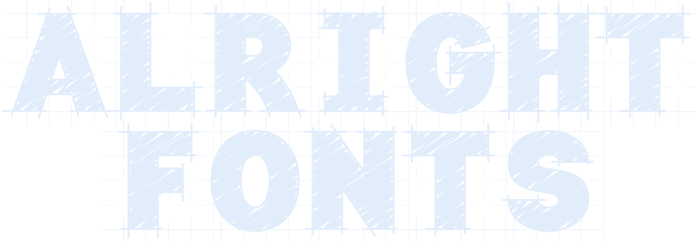

# The font format designed for embedded and low resource platforms.

## Why?

Historically when drawing text microcontrollers have been limited to bitmapped fonts or very simple stroke based fonts - in part to minimise the space required to store font assets and also to make the rendering process fast enough to be done in realtime.

More recently the power and capacity of cheap, embeddable, microcontrollers has increased to the point where for a dollar and change you can be running at hundreds of megahertz with megabytes of flash storage alongside.

It is now viable to render filled, transformed, anti-aliased, and scalable characters that are comparable in quality to the text that we see on our computer screens every day. 

There is, however, still a sticking point. Existing font formats are complicated beasts that define shapes as collections of curves and control points, include entire state machines for pixel hinting, have character pair specific kerning tables, and digital rights management for.. well, yeah.

> The name Alright Fonts was inspired by the QOI (“Quite OK Image Format”) project. Find out more here: https://qoiformat.org/

## Alright Fonts are here to save the day!

Alright Fonts drops the extra bells and whistles and decomposes curves into small straight line segments.

The format is simple to parse, can be tuned for quality, size, speed, or a combination of all three, contains helper metrics for quickly measuring text, and produces surprisingly good results.

Features:

- support for TTF and OTF fonts
- small file size - Roboto Black printable ASCII set in ~4kB (~40 bytes per glyph)
- libraries for C++ and Python
- tunable settings to trade off file size, contour complexity, and visual quality
- glyph dictionary includes advance and bounding box metrics for fast layout
- supports utf-8 codepoints or ascii character code
- support for non ASCII characters such as Kanji (海賊ロボ忍者さる) or Cyrillic
- easy to parse - entire specification is listed below
- coordinates scaled to power of two bounds avoiding slow divide when rendering
- create custom font packs containing only the characters that are needed
- decomposes all glyph contours (strokes) into simple polylines for easy rendering

Alright Fonts includes:

- `afinate` an extraction and encoding tool to create Alright Font (.af) files 
- `python_alright_fonts` a Python library for encoding and loading Alright Fonts
- `alright-fonts-lib` a reference C++ library implementation

The repository also includes some examples:

- `render-demo` a Python demo of rendering text

> The C++reference renderer should be straightforward to embed in any C++ project - alternatively it can be used as a guide for implementing your own renderer.

## Creating a font pack with the `afinate` tool

The `afinate` tool creates new font packs from a TTF or OTF font.

```bash
usage: afinate [-h] [--characters CHARACTERS] --font FONTFILE OUTFILE
```

- `--font FILE`: specify the font to use
- `--quiet`: don't output any status or debug messages during processing

Font data can be output either as a binary file or as source files for C(++) and Python.

- `--format`: output format, either `af` (default), `c`, or `python`
  - `af`: generates a binary font file for embedding with your linker or loading at runtime from a filesystem.
  - `c` generates a C(++) code file containing a const array of font data
  - `python` generates a Python code file containing an array of font data
- `--quality`: the quality of decomposed bezier curves, either `low`, `medium`, or `high` (default: `medium` - affects file size)
  
The list of characters to include can be specified in three ways:

  - default: full printable ASCII set (95 characters)
  - `--characters CHARACTERS`: a list of characters to include in the font pack
  - `--corpus FILE`: a text file containing all of the characters to include
  
For example:

```bash
./afinate --characters 'abcdefg' --font 'fonts/Roboto-Black.ttf' roboto-abcdefg.af
```

The file `roboto-abcdefg.af` is now ready to embed into your project.

## The Alright Fonts file format

An Alright Fonts file consists of an 8-byte header, followed by a number of glyphs, followed by the contour data for the glyphs.

|size (bytes)|description|
|--:|---|
|`8`|header|
|`9`|glyph dictionary entry 1|
|`9`|glyph dictionary entry ..|
|`9`|glyph dictionary entry n|
|variable|glyph 1 contours|
|variable|glyph .. contours|
|variable|glyph n contours|

### Header

The very basic header includes a magic marker for identification, the number of glyphs present in the file, a scaling factor, and a set of flags.

|size (bytes)|name|type|notes|
|--:|---|---|---|
|`4`|`"af!?"`|bytes|magic marker bytes|
|`2`|`count`|unsigned 16-bit|number of glyphs in file|
|`2`|`flags`|unsigned 16-bit|flags (reserved for future use)|

#### Coordinate normalisation and scaling

All coordinates of the glyph (bounding boxes, advances, and contour points) are divided by the largest dimension of the bounding box that contains all glyphs - effectively normalising them to a common `-1..1 x -1..1` box. The coordinates are then multiplied by `127` scaling them up to the range `-128` to `127`.

This scale was chosen for a number of reasons:

- contour coordinates encode as single bytes reducing file size
- provides good enough resolution to retain fine detail even on complex glyphs
- avoid expensive divide when scaling during rendering: `(size_px * coordinate) >> 8`

#### Flags

Let's hedge our bets.

Being an English software developer ~~it's possible~~ an absolute certainty that I don't fully understand every nuance of every language used globally - heck, I can just barely handle my own. 

It's also likely that we may want, in future, to add a feature or two:

- excluding glyph bounding boxes 
- including glyph pair kerning data
- allowing 4-byte character codepoints
- allow a finer scale for coordinates (i.e. `-65536..65535`)
- alternative packing methods for contour data
- better support for vertical or LTR languages

The `flags` field is designed to allow the addition of features like these in the future while allowing parsers to implement none, some, or all of them. If a parser encounters a `1` bit in the `flags` field that it doesn't implement then it should reject the file with an error.

*There are currently no flags and this feature is reserved for future use.*

### Glyph dictionary

Following the header is the glyph dictionary which contains entries for all of the glyphs sorted by their utf-8 codepoint or ascii character code.

Each entry includes the character codepoint, some basic metrics, and length of its contour data.

> The inclusion of bounding box and advance metrics makes it very performant to calculate the bounds of a piece of text (there is no need to interrogate the contour data).

The glyphs are laid out one after another in the file:

|size (bytes)|name|type|notes|
|--:|---|---|---|
|`2`|`codepoint`|unsigned integer|utf-8 codepoint or ascii character code|
|`1`|`bbox_x`|signed integer|left edge of bounding box|
|`1`|`bbox_y`|signed integer|top edge of bounding box|
|`1`|`bbox_w`|unsigned integer|width of bounding box|
|`1`|`bbox_h`|unsigned integer|height of bounding box|
|`1`|`advance`|unsigned integer|horizontal or vertical advance|
|`2`|`contour_size`|unsigned integer|length of contour data in bytes|

...and repeat for one entry per glyph.

### Glyph contour data

Immediately after the glyph dictionary comes the glyph contour data. With each glyph in the same order they appear in the dictionary.

A glyph can have multiple contours, each starts with a 16-bit value containing the number of points in the contour followed by a list of contour coordinates stored as `x`, `y` pairs.

To denote the end of the contours of a glyph there will be a 16-bit zero value - effectively declaring a final contour with no points.

|size (bytes)|name|type|notes|
|--:|---|---|---|
|`2`|`count`|unsigned 16-bit|count of coordinates in first contour|
|`1`|`point 1 x`|signed integer|first point x component|
|`1`|`point 1 y`|signed integer|first point y component|
||..|..|..|
|`1`|`point n x`|signed integer|nth point x component|
|`1`|`point n y`|signed integer|nth  point y component|
|`2`|`count`|unsigned 16-bit|count of coordinates in second contour|
|..|..|..|..|
|`2`|`count`|unsigned 16-bit|0 value denotes end of contours for glyph|

## Examples

### Quality comparison

Here three Alright Fonts files have been generated containing the full set of printable ASCII characters. The font used was Roboto Black and the command line parameters to `afinate` were:

```bash
./afinate --font fonts/Roboto-Black.ttf --quality [low|medium|high]
```

|Low|Medium|High|
|---|---|---|
|3,657 bytes|4,495 bytes|5,681 bytes|
||||

The differences are easier to see when viewing the images at their original size - click to open in a new tab.

### Python `render-demo`

You can pipe the output of `afinate` directly into the `render-demo` example script to product a swatch image.

```bash
./afinate --font fonts/Roboto-Black.ttf --quality high - | ./render-demo
```
